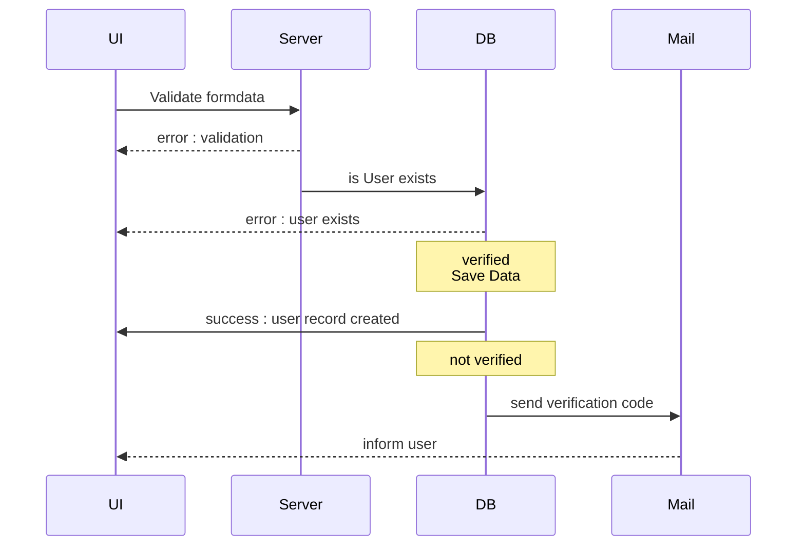

## References

[Node.js](https://nodejs.org/)
[Visual Studio Code](https://code.visualstudio.com)
[React](https://react.dev/)
[Next](http://nextjs.org/)
[Tailwind](https://tailwindcss.com/docs/installation/framework-guides/nextjs)
[Tailwind Prettier](https://tailwindcss.com/blog/automatic-class-sorting-with-prettier)
[jose JWT Library](https://www.npmjs.com/package/jose)
[zod Validation Library](https://zod.dev/)
[bcrypt-ts Password Hash Generator](https://www.npmjs.com/package/bcrypt-ts)
[mssql MS Sql Server Provider](https://www.npmjs.com/package/mssql)
[nodemailer e-Mail Library](https://www.npmjs.com/package/nodemailer)
[react-icons](https://react-icons.github.io/react-icons/)

- Start PowerShell (for Windows OS Security) as an Administrator, run the [Set-ExecutionPolicy] cmdlet with the parameter RemoteSigned
  `Set-ExecutionPolicy RemoteSigned`

## Setup

- [x] [Create app - Install Tailwind CSS with Next.js ](https://tailwindcss.com/docs/installation/framework-guides/nextjs)

```bash
npx create-next-app@latest my-project --typescript --eslint --app
cd my-project
```

- [x] Create [Git-Hub](https://github.com/) repository
- [x] Push your project to remote git repository

```bash
git remote add origin https://github.com/...
git branch -M main
git push -u origin main
```

- [x] packages/types

```bash
npm install -D prettier prettier-plugin-tailwindcss

npm i jose

npm i zod

npm i bcrypt-ts

npm i mssql
npm i --save-dev @types/mssql

npm i nodemailer
npm i --save-dev @types/nodemailer

npm i react-icons
```

# Development

## Authentication

1. Login page/component
   SignUp Component -> signUp Action


