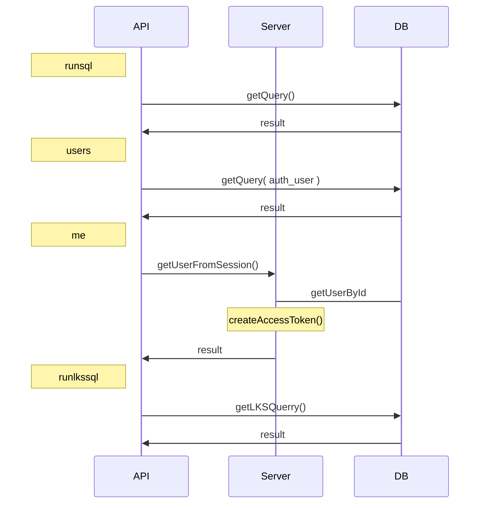

```mermaid
sequenceDiagram
participant A as API
participant S as Server
participant D as DB
Note left of A : runsql
A ->> D : getQuery()
D ->> A : result
Note left of A : users
A ->> D : getQuery( auth_user )
D ->> A : result
Note left of A : me
A ->> S : getUserFromSession()
S -> D : getUserById
Note over S : createAccessToken()
S ->> A : result
Note left of A : runlkssql
A ->> D : getLKSQuerry()
D ->> A : result

```
