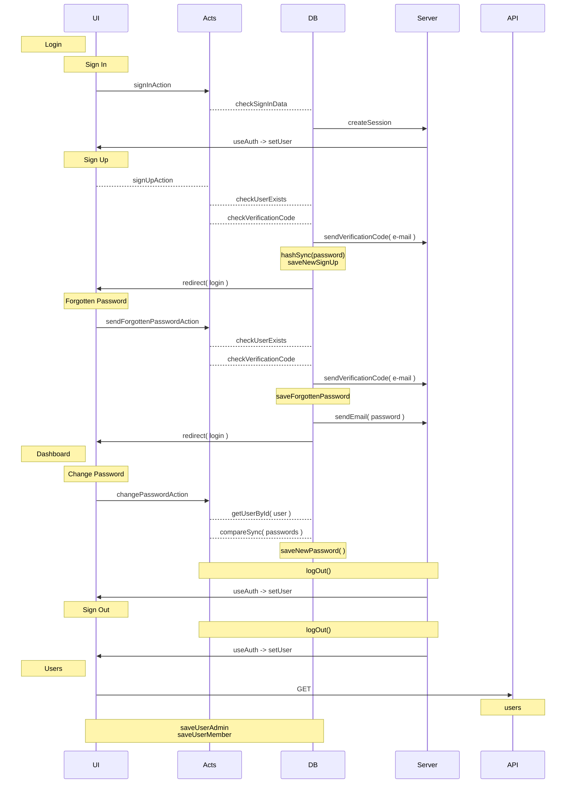

```mermaid
sequenceDiagram
participant U as UI
participant C as Acts
participant D as DB
participant S as Server
participant A as API
Note left of U : Login
Note over U : Sign In
U ->> C : signInAction
C--> D :checkSignInData
D ->> S :createSession
S ->> U :useAuth -> setUser
Note over U :Sign Up
U --> C:signUpAction
C --> D :checkUserExists
C --> D :checkVerificationCode
D ->> S :sendVerificationCode( e-mail )
Note over D :hashSync(password)<br/>saveNewSignUp
D ->> U :redirect( login )
Note over U : Forgotten Password
U ->> C :sendForgottenPasswordAction
C --> D :checkUserExists
C --> D :checkVerificationCode
D ->> S :sendVerificationCode( e-mail )
Note over D : saveForgottenPassword
D ->> S :sendEmail( password )
D ->> U :redirect( login )
Note left of U : Dashboard
Note over U : Change Password
U ->> C : changePasswordAction
C --> D:getUserById( user )
C --> D:compareSync( passwords )
Note over D : saveNewPassword( )
Note over S, C: logOut()
S ->> U :useAuth -> setUser
Note over U : Sign Out
Note over S, C: logOut()
S ->> U :useAuth -> setUser
Note left of U : Users
U ->> A : GET
Note over A : users
Note over U, D : saveUserAdmin<br/>saveUserMember

```
